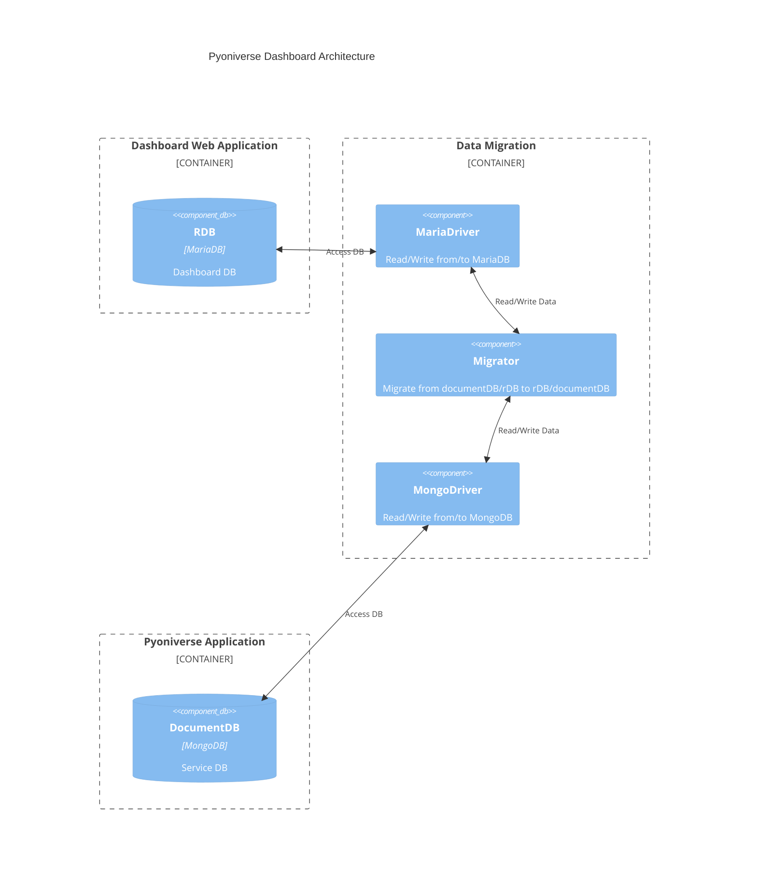

# Data Migrator
## Architecture
| SOA + Domain 기반 + MVC & Humble Pattern

```mermaid
---
title: Pyoniverse Dashboard Architecture
---
C4Component
    title Pyoniverse Dashboard Architecture
    Container_Boundary(web_boundary, "Dashboard Web Application") {
        ComponentDb(rdb, "RDB", "MariaDB", "Dashboard DB")
    }
    Container_Boundary(migration_boundary, "Data Migration") {
        Component(mariaDriver, "MariaDriver", "", "Read/Write from/to MariaDB")
        Component(migrator, "Migrator", "", "Migrate from documentDB/rDB to rDB/documentDB")
        Component(mongoDriver, "MongoDriver", "", "Read/Write from/to MongoDB")
        BiRel(mongoDriver, documentDb, "Access DB")
        BiRel(mariaDriver, rdb, "Access DB")
        BiRel(mongoDriver, migrator, "Read/Write Data")
        BiRel(mariaDriver, migrator, "Read/Write Data")
    }
    Container_Boundary(service_boundary, "Pyoniverse Application") {
        ComponentDb(documentDb, "DocumentDB", "MongoDB", "Service DB")
    }
```
