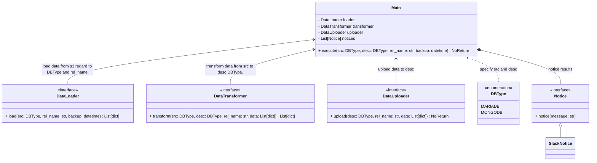

# Data Migrator
## Module Design

```mermaid
classDiagram
    class DataLoader {
        <<interface>>
        + load(src: DBType, rel_name: str, backup: datetime) List[dict]
    }
    class DataTransformer {
        <<interface>>
        + transform(src: DBType, desc: DBType, rel_name: str, data: List[dict]) List[dict]
    }
    class DataUploader {
        <<interface>>
        + upload(desc: DBType, rel_name: str, data: List[dict]) NoReturn
    }
    class DBType {
        <<enumeration>>
        MARIADB
        MONGODB
    }
    class Notice {
        <<interface>>
        + notice(message: str)
    }
    class Main {
        - DataLoader loader
        - DataTransformer transformer
        - DataUploader uploader
        - List[Notice] notices
        + execute(src: DBType, desc: DBType, rel_name: str, backup: datetime) NoReturn
    }
    Main <-- DataLoader: load data from s3 regard to DBType and rel_name.
    Main <-- DataTransformer: transform data from src to desc DBType.
    Main <-- DataUploader: upload data to desc
    Main <.. DBType: specify src and desc
    Main *-- Notice: notice results
    Notice <|-- SlackNotice

```
## Details
- [DataLoader](modules/data-loader.md)
- [DataTransformer](modules/data-transformer.md)
- [DataUploader](modules/data-uploader.md)
