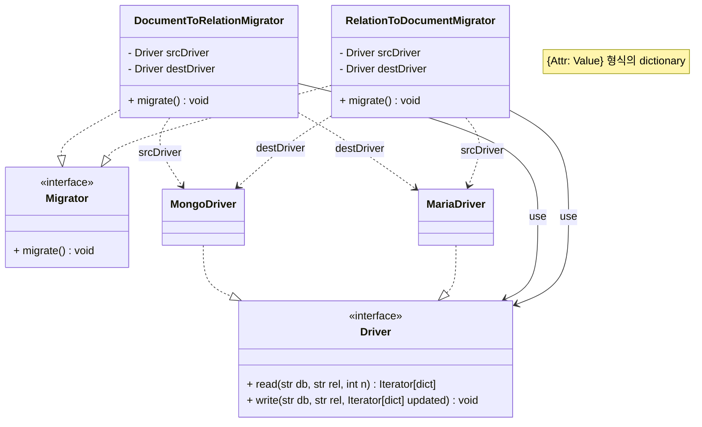
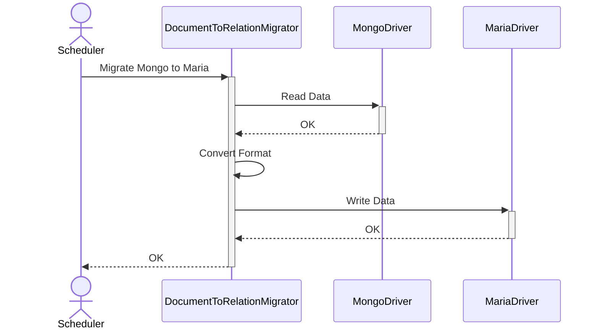

# Data Migrator
## Module Design

```mermaid
classDiagram
    note "{Attr: Value} 형식의 dictionary"
    class Driver {
        <<interface>>
        + read(str db, str rel, int n) Iterator[dict]
        + write(str db, str rel, Iterator[dict] updated) void
    }
    class Migrator {
        <<interface>>
        + migrate() void
    }
    class DocumentToRelationMigrator {
        - Driver srcDriver
        - Driver destDriver
        + migrate() void
    }
    class RelationToDocumentMigrator {
        - Driver srcDriver
        - Driver destDriver
        + migrate() void
    }
    MongoDriver ..|> Driver
    MariaDriver ..|> Driver
    DocumentToRelationMigrator ..|> Migrator
    RelationToDocumentMigrator ..|> Migrator
    DocumentToRelationMigrator --> Driver: use
    RelationToDocumentMigrator --> Driver: use
    DocumentToRelationMigrator ..> MongoDriver: srcDriver
    DocumentToRelationMigrator ..> MariaDriver: destDriver
    RelationToDocumentMigrator ..> MariaDriver: srcDriver
    RelationToDocumentMigrator ..> MongoDriver: destDriver
```

```mermaid
sequenceDiagram
    actor Scheduler
    participant DocumentToRelationMigrator
    participant MongoDriver
    participant MariaDriver
    Scheduler ->>+ DocumentToRelationMigrator: Migrate Mongo to Maria
    DocumentToRelationMigrator ->>+ MongoDriver: Read Data
    MongoDriver -->>- DocumentToRelationMigrator: OK
    DocumentToRelationMigrator ->> DocumentToRelationMigrator: Convert Format
    DocumentToRelationMigrator ->>+ MariaDriver: Write Data
    MariaDriver -->>- DocumentToRelationMigrator: OK
    DocumentToRelationMigrator -->>- Scheduler: OK
```
